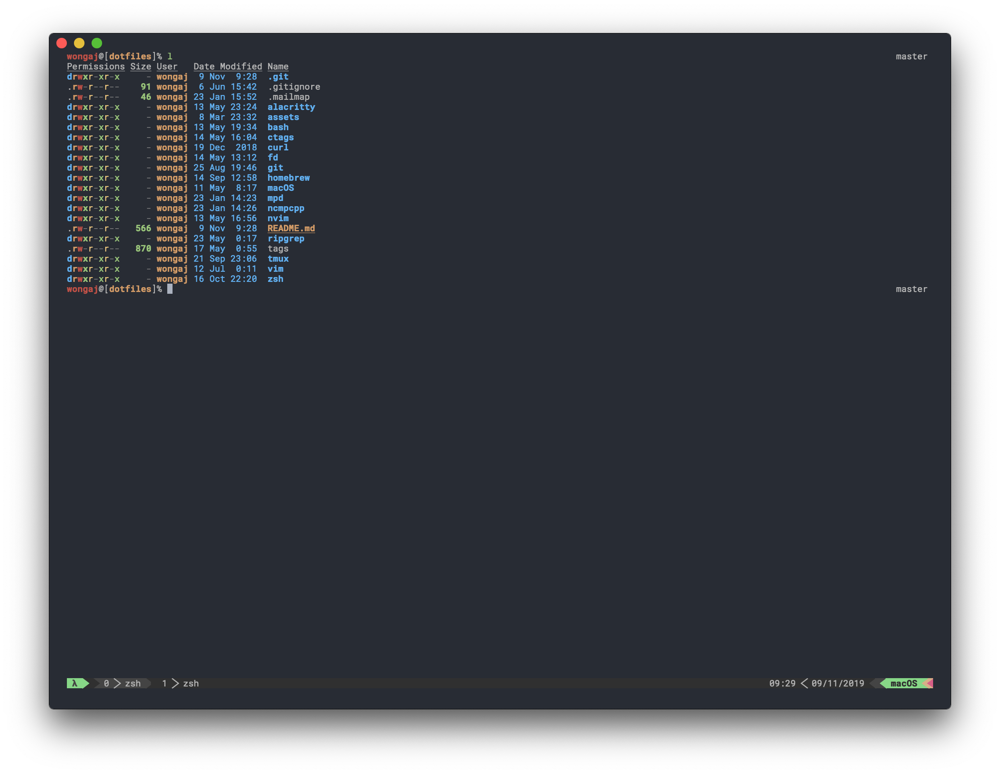

# Dotfiles

Personal dotfiles for macOS.

## Installation

1. Clone this repository
2. Setup `stow`
3. Install the desired settings using `stow <directory>`

## Editor Settings

### Neovim

See `nvim/` directory

### Visual Studio Code

Visual Studio Code is no longer my main editor, but it is still useful for me
to quickly view and editor files.

See settings [here](https://gist.github.com/ajw998/9eca8ae0422e1a56431c550598c9387f) (Generated using [Settings Sync](https://marketplace.visualstudio.com/items?itemName=Shan.code-settings-sync))

## LICENSE

GPL
